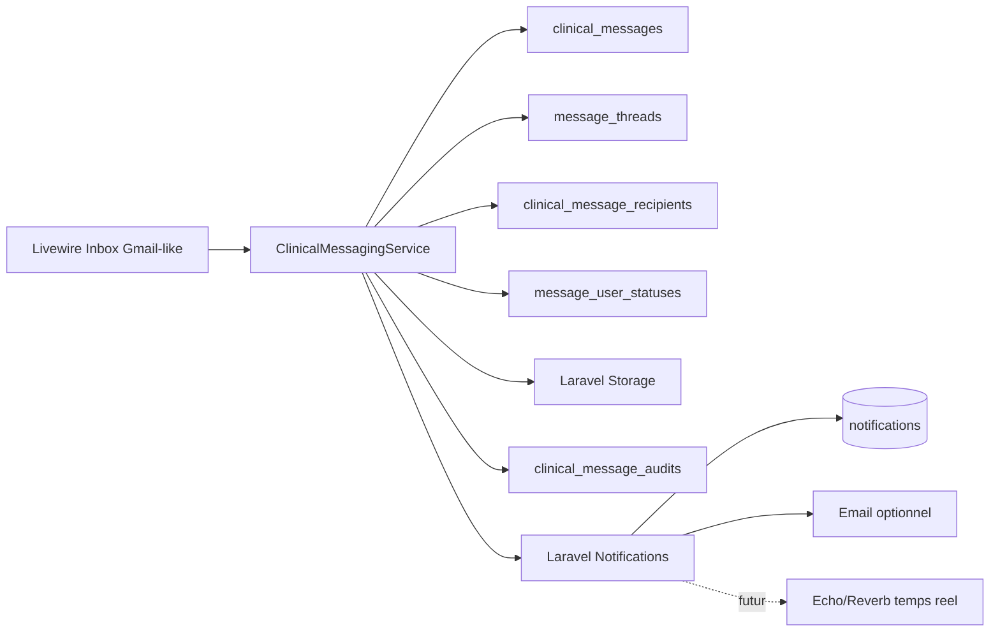
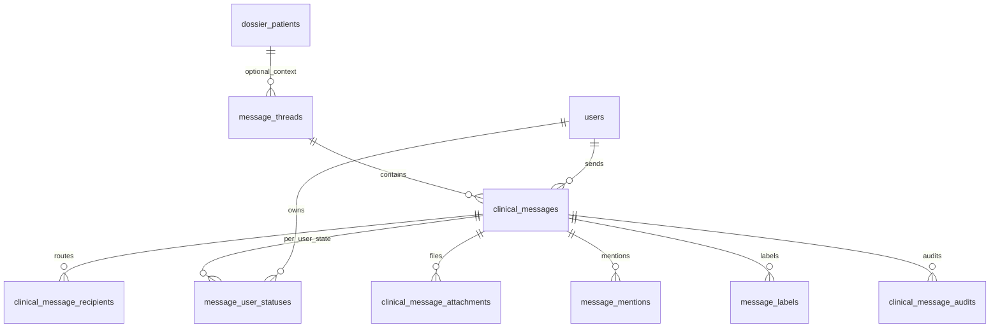
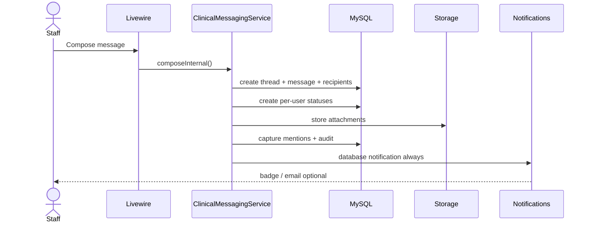

# Messagerie clinique interne

## Objectif

Ce module fournit une messagerie interne indépendante des communications patient. Les patients ne sont jamais destinataires des messages `message_type = internal`; le dossier patient est uniquement un contexte optionnel.

## Architecture

## Tables

## Flux d'envoi

## Permissions

Accès à une conversation interne si:

- l'utilisateur appartient au même hôpital;
- le message est `internal`;
- l'utilisateur est expéditeur ou destinataire.

Les règles métier plus fines peuvent être ajoutées dans `ClinicalMessagePolicy::send()`:

- infirmier vers direction selon politique locale;
- chef de service vers son département;
- administrateur limité aux conversations autorisées.

## Notifications

`InternalClinicalMessageNotification` utilise toujours le canal `database`. L'email est optionnel via préférence utilisateur. Pour le temps réel, brancher l'événement après `notifyInternalRecipients()` avec Laravel Reverb/Echo afin de pousser:

- badge non lu;
- nouveau message;
- toast critique;
- mise à jour de compteur.

## UI

La page `/messagerie` expose:

- dossiers: réception, envoyés, brouillons, favoris, important, coordination, urgent, service, archives, corbeille;
- recherche globale sur sujet, corps, expéditeur, destinataires et patient;
- filtres catégorie, priorité, date;
- liste dense avec avatar, sujet, aperçu, date, pièce jointe, priorité, lu/non lu;
- fil complet type Gmail avec citations et pièces jointes;
- fenêtre de composition avec utilisateurs, groupes, services, patient optionnel et fichiers.

## Performance et montée en charge

- Index principaux: `hopital_id`, `message_type`, `status`, `last_activity_at`, `thread_id`, `user_id/read_at`.
- Pagination serveur sur la boîte.
- Etats par utilisateur dans `message_user_statuses`, évitant de dupliquer les messages.
- Pièces jointes stockées hors base via Laravel Storage.
- Notifications Laravel en queue.
- Pour plusieurs milliers d'utilisateurs: diffuser aux groupes/services via jobs chunkés, ajouter un index full text MySQL sur `subject/body/recipient_summary`, et archiver par politique de rétention.

## Conformité hospitalière

- Séparation explicite patient/interne.
- Patient seulement en contexte optionnel.
- Journal d'audit pour création, lecture, réponse, archivage, suppression et marquages.
- Téléchargements contrôlés par service/policy.
- Prévoir une politique de rétention par établissement et exports d'audit.
